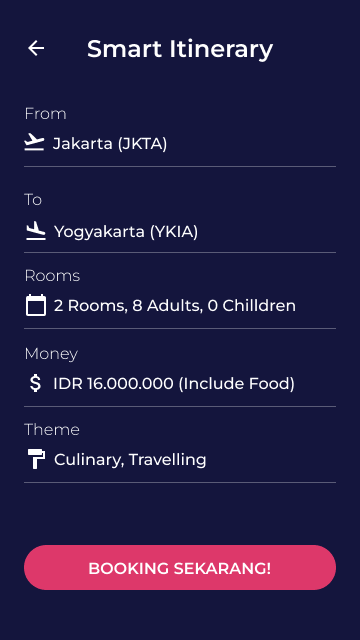
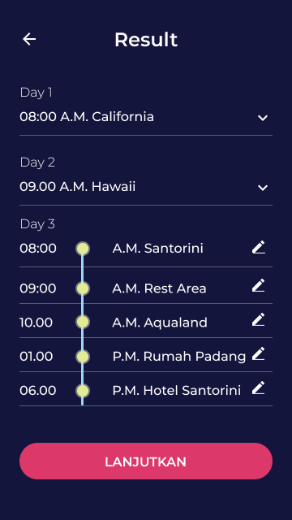
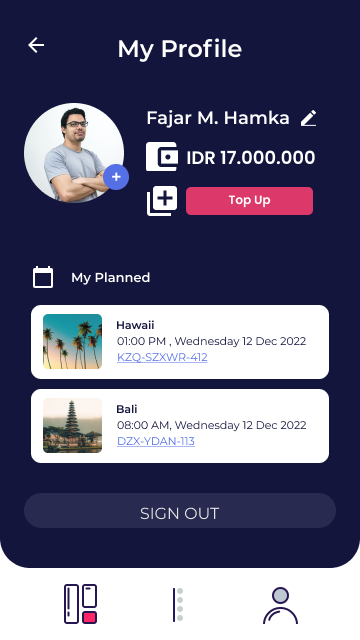
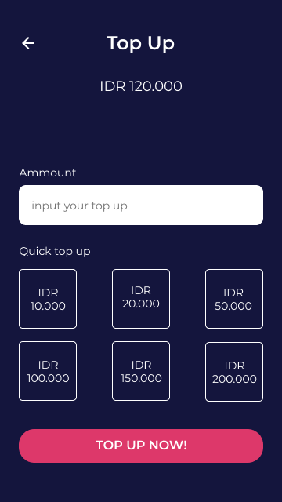

# Just Go!
Just go is recommended system to person who want to travelling. This application can make itinerary fast.
This app using Content Based Filtering to get recommended system with Cosine Similarity Algorithm.

# How to use Recommended System
To run Recommended System, this is the requirement:

1. Install numpy
```
pip install numpy
```
2. Install Pandas
```
pip install pandas
```
3. Install sklearn
```
pip install sklearn
```
4. Install jupyter notebook in extension vscode
5. For alternative without installation, you can use google collab for run the recommended system.
6. Dont forget to download the data set ok !

# How to use Android App
To run Android App, this is the requirement:

1. Have an account firebase
2. Connect to the firebase
3. Minimum API 28 Android

# Result

## Splash Screen


## OB 1


## OB 2


## Sign In


## Sign Up


## Sign Up Photo Screen


## Sign Up Photo Screen Exist


## Homescreen


## Smart Itinerary


## Result of Itinerary


## Detail Vacation (Additional Feature)


## Profile


## Top Up
